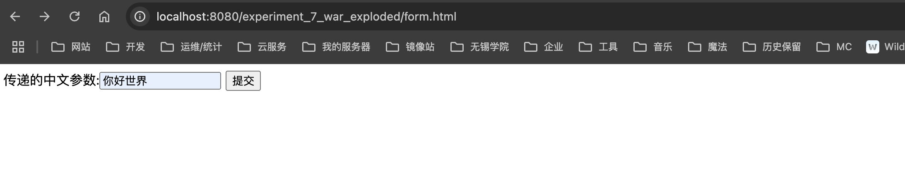

# 第七次实验


## 实验内容

### 创建过滤器及配置过滤规则

#### 源代码

```jsp
<%@ page contentType="text/html;charset=UTF-8" language="java" %>
<%@ taglib prefix="c" uri="http://java.sun.com/jsp/jstl/core" %>
<html>
<head>
  <title>显示数据</title>
</head>
<body>
<h3>从Servlet转发过来的request内置对象的数据如下：</h3>
<ul>
  <c:forEach var="name" items="${names}">
    <li>${name}</li>
  </c:forEach>
</ul>
</body>
</html>
```

```java
package com.xlf.school.experiment7.filter;

import java.io.IOException;
import javax.servlet.Filter;
import javax.servlet.FilterChain;
import javax.servlet.FilterConfig;
import javax.servlet.ServletException;
import javax.servlet.ServletRequest;
import javax.servlet.ServletResponse;
import javax.servlet.annotation.WebFilter;

@WebFilter({ "/TestServlet" })
public class TestFilter implements Filter {

    public TestFilter() {
    	System.out.println("过滤器构造函数运行");
    }

	@Override
	public void destroy() {
		System.out.println("过滤器消亡函数运行");
	}

	@Override
    public void doFilter(ServletRequest request, ServletResponse response, FilterChain chain) throws IOException, ServletException {
		// place your code here
		System.out.println("对请求进行了过滤处理");
		// pass the request along the filter chain
		chain.doFilter(request, response);
		System.out.println("执行chain.doFilter方法后面的代码");
	}

	@Override
	public void init(FilterConfig fConfig) throws ServletException {
		System.out.println("过滤器初始化函数运行");
	}

}
```

```java
package com.xlf.school.experiment7.servlet;

import javax.servlet.ServletException;
import javax.servlet.annotation.WebServlet;
import javax.servlet.http.HttpServlet;
import javax.servlet.http.HttpServletRequest;
import javax.servlet.http.HttpServletResponse;
import java.io.IOException;

@WebServlet("/TestServlet")
public class TestServlet extends HttpServlet {
    private static final long serialVersionUID = 1L;

    public TestServlet() {
        System.out.println("Servlet构造函数运行");
    }

    @Override
    protected void doGet(HttpServletRequest request, HttpServletResponse response) throws ServletException, IOException {
        System.out.println("Servlet请求处理");
    }

    @Override
    protected void doPost(HttpServletRequest request, HttpServletResponse response) throws ServletException, IOException {
        // TODO Auto-generated method stub
        doGet(request, response);
    }

}
```

#### 截图


### 过滤器设置请求和响应的编码方式

#### 源代码

```html
<!DOCTYPE html>
<html>
<head>
    <meta charset="UTF-8">
    <title>Insert title here</title>
</head>
<body>
<form action="EncodingSevlet" method="post">
    传递的中文参数:<input type="text" name="param"/>
    <input type="submit" value="提交"/>
</form>
</body>
</html>
```

```java
package com.xlf.school.experiment7.servlet;

import javax.servlet.ServletException;
import javax.servlet.annotation.WebServlet;
import javax.servlet.http.HttpServlet;
import javax.servlet.http.HttpServletRequest;
import javax.servlet.http.HttpServletResponse;
import java.io.IOException;

@WebServlet("/EncodingSevlet")
public class EncodingSevlet extends HttpServlet {
    private static final long serialVersionUID = 1L;

    public EncodingSevlet() {
        super();
    }

    @Override
    protected void doGet(HttpServletRequest request, HttpServletResponse response) throws ServletException, IOException {

        String param = request.getParameter("param");
        if (param != null) {
            System.out.println(param);
            request.getSession().setAttribute("param", param);

            response.sendRedirect("showparam.jsp");
        }
    }

    @Override
    protected void doPost(HttpServletRequest request, HttpServletResponse response) throws ServletException, IOException {
        doGet(request, response);
    }

}
```

```jsp
<%@ page language="java" contentType="text/html; charset=UTF-8"
         pageEncoding="UTF-8" %>
<!DOCTYPE html>
<html>
<head>
    <meta http-equiv="Content-Type" content="text/html; charset=UTF-8">
    <title>Insert title here</title>
</head>
<body>
<%=session.getAttribute("param") %>
</body>
</html>
```

```java
package com.xlf.school.experiment7.filter;

import javax.servlet.*;
import javax.servlet.annotation.WebFilter;
import java.io.IOException;

@WebFilter({"/EncodingFilter", "/*"})
public class EncodingFilter implements Filter {
    public EncodingFilter() {
    }

    @Override
    public void destroy() {
    }

    @Override
    public void doFilter(ServletRequest request, ServletResponse response, FilterChain chain) throws IOException, ServletException {
        request.setCharacterEncoding("utf-8");
        chain.doFilter(request, response);
        response.setCharacterEncoding("utf-8");
    }

    @Override
    public void init(FilterConfig fConfig) throws ServletException {
    }
}
```

#### 截图




### 利用过滤器处理访问权限

#### 源代码

```html
<!DOCTYPE html>
<html>
<head>
    <meta charset="UTF-8">
    <title>Insert title here</title>
</head>
<body>
<form action="LoginServlet" method="post">
    用户名:<input type="text" name="username"><br>
    密&nbsp;&nbsp;&nbsp;码:<input type="password" name="password"><br>
    <input type="submit" value="提交">
    <input type="reset" value="取消">
</form>
</body>
</html>
```

```java
package com.xlf.school.experiment7.servlet;

import javax.servlet.ServletException;
import javax.servlet.annotation.WebServlet;
import javax.servlet.http.HttpServlet;
import javax.servlet.http.HttpServletRequest;
import javax.servlet.http.HttpServletResponse;
import java.io.IOException;

@WebServlet("/LoginServlet")
public class LoginServlet extends HttpServlet {
    private static final long serialVersionUID = 1L;

    public LoginServlet() {
        super();
    }

    @Override
    protected void doGet(HttpServletRequest request, HttpServletResponse response) throws ServletException, IOException {
        String username = request.getParameter("username");
        String password = request.getParameter("password");
        if (username != null && password != null) {
            if (username.equals(password)) {
                request.getSession().setAttribute("username", username);
                response.sendRedirect("user/index.jsp");
            }
        }
    }

    @Override
    protected void doPost(HttpServletRequest request, HttpServletResponse response) throws ServletException, IOException {
        doGet(request, response);
    }
}
```

```jsp
<%@ page language="java" contentType="text/html; charset=UTF-8"
         pageEncoding="UTF-8" %>
<!DOCTYPE html>
<html>
<head>
    <meta http-equiv="Content-Type" content="text/html; charset=UTF-8">
    <title>Insert title here</title>
</head>
<body>
欢迎你,<%=session.getAttribute("username") %>
<a href="../LogoutServlet">退出登录</a>
</body>
</html>
```

#### 截图


### 监听器的创建以及监听事件配置

#### 源代码

```java
package com.xlf.school.experiment7.listener;

import javax.servlet.ServletContext;
import javax.servlet.annotation.WebListener;
import javax.servlet.http.*;

@WebListener
public class TestListener implements HttpSessionListener, HttpSessionAttributeListener {

    private int count = 0;
    private int userCount = 0;

    public TestListener() {
    }

    @Override
    public void sessionCreated(HttpSessionEvent se) {
        count++;
        HttpSession session = se.getSession();
        ServletContext context = session.getServletContext();
        context.setAttribute("count", count);

    }

    @Override
    public void sessionDestroyed(HttpSessionEvent se) {
    }

    @Override
    public void attributeAdded(HttpSessionBindingEvent se) {
        String attribute = se.getName();
        if (attribute.equals("username")) userCount++;
        HttpSession session = se.getSession();
        ServletContext context = session.getServletContext();
        context.setAttribute("usercount", userCount);

    }

    @Override
    public void attributeRemoved(HttpSessionBindingEvent se) {
        String attribute = se.getName();
        if (attribute.equals("username")) userCount--;
        HttpSession session = se.getSession();
        ServletContext context = session.getServletContext();
        context.setAttribute("usercount", userCount);

    }

    @Override
    public void attributeReplaced(HttpSessionBindingEvent se) {
    }

}
```


### 创建监听器以实现统计网站访问量以及在线人数

#### 源代码

```jsp
<%@ page language="java" contentType="text/html; charset=UTF-8"
         pageEncoding="UTF-8" %>
<!DOCTYPE html>
<html>
<head>
    <meta http-equiv="Content-Type" content="text/html; charset=UTF-8">
    <title>Insert title here</title>
</head>
<body>
历史访问总量:<%=(application.getAttribute("count") == null) ? 0 : application.getAttribute("count")%><br>
在线用户人数:<%=(application.getAttribute("usercount") == null) ? 0 : application.getAttribute("usercount")%><br>
</body>
</html>
```

```java
package com.xlf.school.experiment7.listener;

import javax.servlet.ServletContext;
import javax.servlet.annotation.WebListener;
import javax.servlet.http.*;

@WebListener
public class TestListener implements HttpSessionListener, HttpSessionAttributeListener {

    private int count = 0;
    private int userCount = 0;

    public TestListener() {
    }

    @Override
    public void sessionCreated(HttpSessionEvent se) {
        count++;
        HttpSession session = se.getSession();
        ServletContext context = session.getServletContext();
        context.setAttribute("count", count);

    }

    @Override
    public void sessionDestroyed(HttpSessionEvent se) {
    }

    @Override
    public void attributeAdded(HttpSessionBindingEvent se) {
        String attribute = se.getName();
        if (attribute.equals("username")) userCount++;
        HttpSession session = se.getSession();
        ServletContext context = session.getServletContext();
        context.setAttribute("usercount", userCount);

    }

    @Override
    public void attributeRemoved(HttpSessionBindingEvent se) {
        String attribute = se.getName();
        if (attribute.equals("username")) userCount--;
        HttpSession session = se.getSession();
        ServletContext context = session.getServletContext();
        context.setAttribute("usercount", userCount);

    }

    @Override
    public void attributeReplaced(HttpSessionBindingEvent se) {
    }
}
```

```java
package com.xlf.school.experiment7.servlet;

import javax.servlet.ServletException;
import javax.servlet.annotation.WebServlet;
import javax.servlet.http.HttpServlet;
import javax.servlet.http.HttpServletRequest;
import javax.servlet.http.HttpServletResponse;
import javax.servlet.http.HttpSession;
import java.io.IOException;

@WebServlet("/LogoutServlet")
public class LogoutServlet extends HttpServlet {
    private static final long serialVersionUID = 1L;

    public LogoutServlet() {
        super();
    }

    @Override
    protected void doGet(HttpServletRequest request, HttpServletResponse response) throws ServletException, IOException {
        HttpSession session = request.getSession(false);
        if (session != null) {
            if (session.getAttribute("username") != null) {
                session.invalidate();
            }
            response.sendRedirect("login.html");
        }
    }

    @Override
    protected void doPost(HttpServletRequest request, HttpServletResponse response) throws ServletException, IOException {
        doGet(request, response);
    }
}
```

#### 截图


